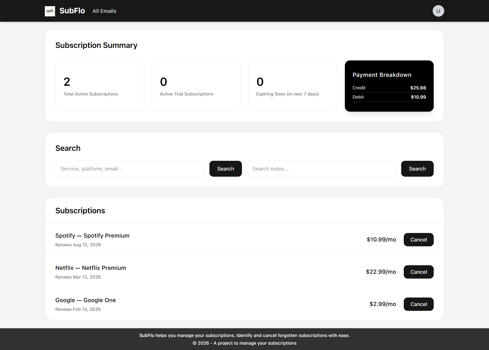
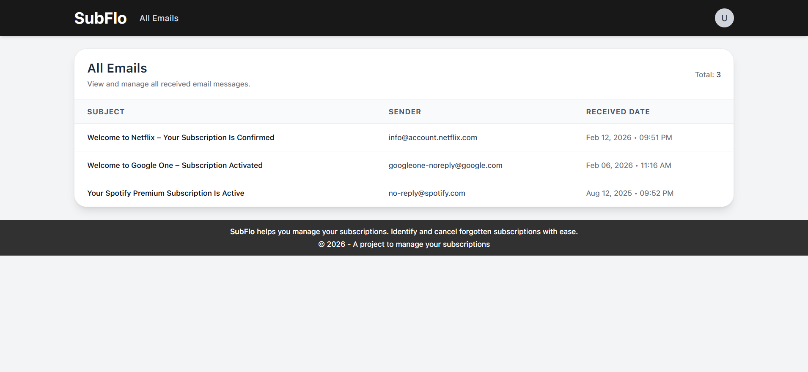
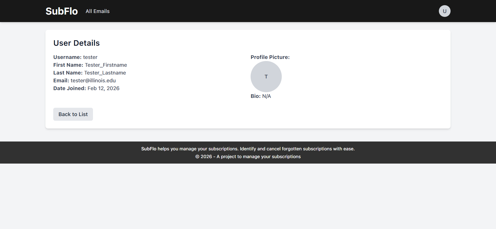

# What is and Why SubFlo?
*SubFlo* comes from **“subscription” + “flow.”** It’s a web application designed to help users identify and manage forgotten subscriptions. By scanning emails and transaction histories, *SubFlo* detects active subscriptions and displays them in a dashboard, including direct links to unsubscribe from services with ease.

# UI
- **Navbar**: Integrated navigation links to the three main pages—Dashboard (home page), All Emails, and User Profile—allowing users to switch between them quickly and easily.

- **Dashboard**: Displays an overview of all subscription information, including key details and a summary section at the top.

- **All Emails**: Lists all subscription-related emails that are processed to extract subscription data.

- **User Profile**: Shows detailed user information and account settings.

# Applications
- `accounts`: Handles the business logic for managing user accounts and authentication via Google SSO.
- `dashboard`: Provides all APIs needed to display relevant information on a user’s dashboard, making it effortless to track subscriptions.
- `subscriptions`: Handles the LLM-based logic for extracting and analyzing subscriptions from users’ emails. All subscription details shown on the `dashboard` are generated by this app.

# Models
- `User`: The default Django user model
- `UserProfile`: Extends the Django User model to store additional user profile information.
- `Subscription`: Represents a user's subscription in various platforms.
- `EmailMessage` Represents a user's email message.

# Current Status
- Week 1
  - [x] Wireframes completed
  - [x] Data models and ER diagrams designed
  - [x] Initial Django applications created
- Week 2
  - [x] Dashboard to display all subscription (Note: Still need to be enhanced to handle displaying for a specific user after auth feature is completed)
  - [x] Separate settings: development and production
  - [x] Create a note regarding the branching strategy
- Week 3
  - [x] Create a summary at the top of dashboard
  - [x] Search functionality
  - [x] Redesign database (add `is_trial`, add `id` in `UserProfile`)
  - [x] Add hyperlinks + Logo in navbar (Note: Still need to be enhanced to show emails, subscriptions, and user profile of a specific user once auth feature is completed)

# References
- Code examples from INFO 490 classes
- Django Models: https://docs.djangoproject.com/en/5.2/ref/models/fields/
- ER Diagram: https://www.cs.rpi.edu/~sibel/csci4380/fall2022/course_notes/er.html