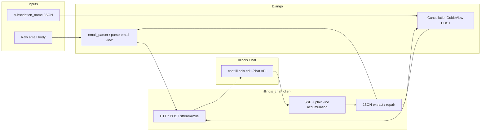

# SubFlo — Part 2: AI System Design & Part 3: Evaluation

Code references: [`subscriptions/email_parser.py`](../subscriptions/email_parser.py), [`subscriptions/illinois_chat_client.py`](../subscriptions/illinois_chat_client.py), [`subscriptions/ai_guide_view.py`](../subscriptions/ai_guide_view.py), [`scripts/part3_eval_run.py`](../scripts/part3_eval_run.py).

---

## Part 2 — AI system design

### Step 2.1 — AI workflow

| Stage | **Email → JSON** (`parse_email_to_json`) | **Cancel guide** (`POST /subscriptions/cancel-guide/`) |
|--------|-------------------------------------------|----------------------------------------------------------|
| **User input** | Raw email body (from paste/API or pipeline) | JSON `{"subscription_name": "<service>"}` from authenticated UI |
| **Preprocessing** | `_preprocess`: trim, collapse whitespace, strip controls, cap length (`email_parser`) | `sanitize_input`, length cap, keyword / charset checks (`ai_guide_view`) |
| **Model** | Illinois Chat over HTTPS; model id from `ILLINOIS_MODEL` (default `qwen3:32b`) | Same client and env |
| **Generation** | System+user messages → streaming POST → accumulate text → strip `<think>`, brace-slice JSON, trailing-comma repair → `json.loads` | Same stream path → strip thinking / fences → brace-slice → comma repair → parse guide JSON |
| **Return to user** | `dict` or `None` to caller (dashboard / `parse-email` JSON) | `JsonResponse` with `{ "guide": { … } }` or error JSON + HTTP status |

### Step 2.2 — Architecture

Remote-LLM pattern (no vector DB on these two endpoints). Gmail sync and DB persistence are outside this diagram.



**Caption:** User input hits a Django view or parser entrypoint; both call `call_illinois_chat_messages` → Illinois Chat returns an SSE/plain-text stream; the client assembles text and views post-process into structured JSON for the response.

### Step 2.3 — Model selection rationale

- **Selected:** **`qwen3:32b`** via Illinois Chat (`ILLINOIS_MODEL`), hosted at **chat.illinois.edu**, with secrets **`ILLINOIS_API_KEY`**, **`ILLINOIS_PROJECT_NAME`**, **`ILLINOIS_API_URL`** (Colab-style), streaming on.
- **Why:** Strong instruction-following and JSON adherence for short extraction and guide tasks; no local GPU RAM requirement; same stack as course Colab (`requests` + Illinois endpoint).
- **Alternatives from A6/A7:** A6/A8 explored **local** pipelines (e.g. Hugging Face `transformers`, quantized **Granite** in [`llm-test/A8/rag_analysis.md`](../llm-test/A8/rag_analysis.md), embedding + chunking experiments). Those taught cost/latency/hardware tradeoffs but are heavy for a small Django deployment and slow cold-starts on CPU.
- **Earlier integrated option:** **GPT-OSS 20B** on the same API worked but emitted `<think>` and occasional invalid JSON (trailing commas). **Qwen 3** was chosen to improve structured outputs while staying on one hosted API.
- **Fit for SubFlo:** Two call sites (email schema + cancellation JSON) need reliable **structured** text, not RAG over a private corpus at inference time for these routes—hosted Qwen matches that profile.

---

## Part 3 — Integrated feature evaluation

### Step 3.1 — Five realistic inputs

1. Netflix-style **paid subscription** confirmation (plan, price, dates, payment snippet).  
2. Spotify-style **trial** email (trial window, renewal price).  
3. **Marketing-only** email (“no subscription”, promo).  
4. **Messy** Netflix confirmation (extra blank lines, cross-sell line).  
5. **Cancel guide** `POST /subscriptions/cancel-guide/` with `{"subscription_name": "Netflix"}` (authenticated client).

Fixtures: [`scripts/part3_eval_run.py`](../scripts/part3_eval_run.py).

### Step 3.2 — Evaluation table

Re-run after model/env changes: `python scripts/part3_eval_run.py` (stdout only; redirect to a file if you need a log).

| # | Input | Expected | Actual (recent run) | Quality / correctness | Structure | Latency | Weakness |
|---|--------|----------|---------------------|-------------------------|-----------|---------|----------|
| 1 | Paid Netflix | JSON with core subscription fields | Parsed dict (Netflix, plan, price, dates, etc.) | Useful for dashboard | Valid JSON keys | ~6–15 s | Card masking / URL normalization may vary |
| 2 | Spotify trial | JSON, `is_trial: true` | Parsed dict with trial dates | Good | Valid JSON | ~5–13 s | Occasional prose-only runs under older prompts/models |
| 3 | Promo only | No subscription → `null` or sentinel | `null` | Correct “no extract” | N/A | ~4–8 s | Same `null` as parse-fail without extra signal |
| 4 | Messy Netflix | JSON despite noise | Parsed dict | Good | Valid JSON | ~5–9 s | Model may invent `end_date` if email implies “next billing” only |
| 5 | Cancel Netflix | HTTP 200, `guide` object | 200 + steps, URL, warnings | Actionable advisory text | Matches view contract | ~10–14 s | URLs/UI copy drift; not legal advice |

### Step 3.3 — Failure analysis (≥2)

1. **Non-subscription vs parse failure.** Promo input returns **`null`** when the model does not return strict JSON *or* when extraction correctly finds nothing—callers cannot tell **“not a subscription”** from **“model/API error”** without extra signaling (e.g. explicit `NOT_SUBSCRIPTION` line or HTTP subcode).  
2. **Hosted latency + advisory risk.** Illinois Chat adds **network + queue** latency (often seconds per call). Cancellation steps are **LLM-generated**: links and button labels can be outdated vs the live service; users must still verify in-product.

### Step 3.4 — Improvement attempt

| | **Before** | **After** |
|---|------------|-----------|
| **Integration** | Mixed `uiuc.chat` / wrong `course_name`; 403s; env names inconsistent | **chat.illinois.edu** URL; Colab-style **`ILLINOIS_API_*`** + **`ILLINOIS_PROJECT_NAME`**; optional **`ILLINOIS_MODEL`** |
| **Streaming** | Assumed OpenAI-style JSON chunks only | Accumulate **SSE JSON + plain lines**; skip `<think>…</think>`; tolerate **trailing commas** before `]`/`}` before `json.loads` |
| **Guides / email JSON** | Strict parse often failed on thinking + bad commas | Strip thinking, brace-slice outer object, comma repair in **`ai_guide_view`** and **`email_parser`** |
| **Model** | Default hosted GPT-OSS path | Default **`qwen3:32b`** for better JSON adherence on the same API |

**Why it helped:** Auth and streaming actually matched the Request Builder; text assembly captured Illinois’ mixed stream format; post-processing recovered common JSON syntax errors; Qwen reduced prose-only failures on structured tasks compared to our earlier runs on the same fixtures.

---

## Reproduction

```bash
pip install -r requirements.txt
cd /path/to/5_SubFlo
# Set ILLINOIS_API_KEY (+ ILLINOIS_PROJECT_NAME, ILLINOIS_MODEL if needed) in .env
python scripts/part3_eval_run.py
```

Creates/reuses Django user `part3_eval_user` / `part3_eval_pass` for test (5). Never commit `.env`.
